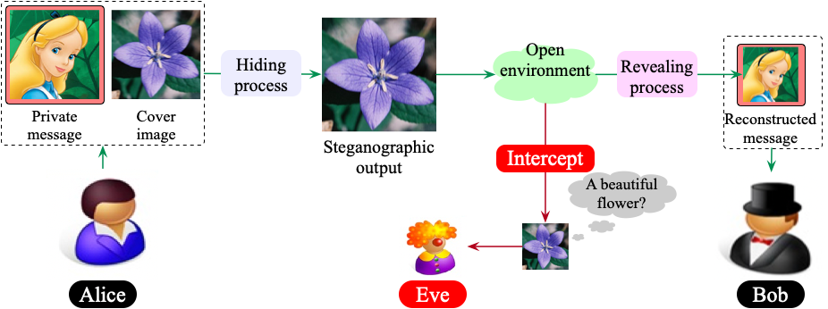
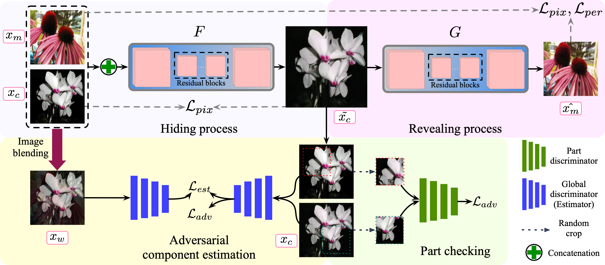

## Introduction
CAIS is a [Tensorflow](http://tensorflow.org/)-based framework for training and testing of our paper: ***Component Aware Image Steganography via Adversarial Global-and-Part Checking***.

## Installation
1. We use [Anaconda3](https://www.anaconda.com/products/individual) as the basic environment. If you have installed the Anaconda3 in path `Conda_Path`, please create a new virtual environment by `conda create -n tf114`, then `source activate tf114`. Install `tensorflow-gpu` using the command `conda install tensorflow-gpu==1.14.0`.
2. Install the dependencies by `pip install -r requirements.txt` (if necessary). The `requirements.txt` file is provided in this package.
3. Please download the pre-trained VGG19 model [imagenet-vgg-verydeep-19.mat](https://www.vlfeat.org/matconvnet/models/imagenet-vgg-verydeep-19.mat), then place it at the current path.

## Data preparation
### 102Flowers (Within-domain)
Please download the original image files from [this](http://www.robots.ox.ac.uk/~vgg/data/flowers/102/102flowers.tgz). Decompress this file and prepare the training and testing image files as follows: 
```
mkdir datasets
cd datasets
mkdir flower
# The directory structure of flower should be this:
├──flower
   ├── train_cover
       ├── cover1.jpg 
       └── ...
   ├── train_message
       ├── message1.jpg 
       └── ...
   ├── test_cover
       ├── test_a.jpg (The test cover image that you want)
       └── ... 
   ├── test_message
       ├── test_b.jpg (The test message image that you want)
       └── ... 
```
We also provide a simple `prepare.py` file to randomly split the images. Please edit the `img_path` to specify the image path before running this file.

### 102Flowers and Caricature dataset (Cross-domain)
Please download the [caricature image dataset](https://www.kaggle.com/ranjeetapegu/caricature-image). We follow the training/testing split of this dataset. And prepare the traing/testing images as follows:
```
mkdir flowercari
# The directory structure of flower should be this:
├──flowercari
   ├── train_cover
       ├── cover1.jpg (the same 7000 flower images)
       └── ...
   ├── train_message (the train caricature images)
       ├── message1.jpg 
       └── ...
   ├── test_cover
       ├── test_a.jpg (The rest flower images)
       └── ... 
   ├── test_message
       ├── test_b.jpg (The test caricature images)
       └── ... 
```

## Train
`sh scripts/train_flower.sh`.
You can also edit the default parameters referring the `main.py`.

## Test
`sh scripts/test_flower.sh`. Generate the steganographic images by using random two images: one cover image and one message image.

## Reconstruction
`sh scripts/recon_flower.sh`. Reconstruct the message images by using the steganographic images. Please specify the `stegano_dir` and `recon_dir` while running this procedure.

## Losses
- [Perceptual loss](https://arxiv.org/abs/1603.08155).
- `LSGAN`: [Least Square GAN](https://arxiv.org/abs/1703.07737).

## Image steganography description


## The detailed CAIS model


## Pre-trained model
* Flower: [Google Drive](https://drive.google.com/drive/folders/1F4o41UNba8I02hsx0JAmz_QeRUoHsHBY?usp=sharing); [BaiduYun](https://pan.baidu.com/s/1mF1UpfYLs_O9s1r4-0LCtA) (1u8c)
* Flowercari: [Google Drive](https://drive.google.com/drive/folders/1F4o41UNba8I02hsx0JAmz_QeRUoHsHBY?usp=sharing); [BaiduYun](https://pan.baidu.com/s/1NOyNTDgdpR44fjt_CciWTw) (ykc3)
* ImageNet: [Google Drive](https://drive.google.com/drive/folders/1F4o41UNba8I02hsx0JAmz_QeRUoHsHBY?usp=sharing); [BaiduYun](https://pan.baidu.com/s/1D0yst70-_1OiQZfw7i_taA) (9fto)

All the models are trained at the resolution `256*256`. Please put them at the path `./check` and unzip them.


## TODO list
* Add the analysis tools.

## Citation

If you find our work useful in your research, please consider citing:

```bibtex

```

## Acknowledgments
Code borrows from [CycleGAN](https://github.com/junyanz/CycleGAN) and [DCGAN](https://github.com/carpedm20/DCGAN-tensorflow). The network architecture design is modified from DCGAN. The generative network is adopted from neural-style with Instance Normalization.